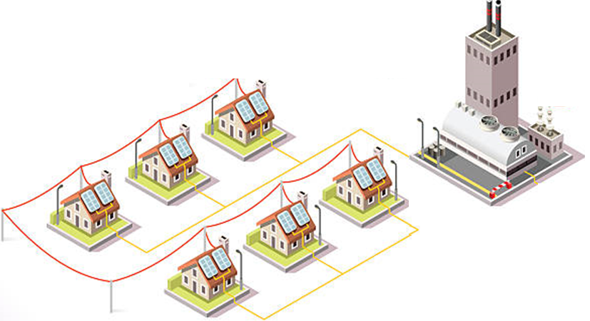

# Power Grid - Semester Assignment 2

## ⚠️ IMPORTANT ⚠️
To ensure you have thoroughly understood the material in this assignment, you may be invited to describe your solution after the submission deadline. This is intended to minimize the use of AI tools and prevent plagiarism. A random group of 20 students will be selected to meet with Sondre and/or Martin to present their work.

**If you are unable to explain your solution adequately, points will be deducted.**

The 20 students will receive an invitation on their student email. Those that do not respond to the email or do not show up to their meeting **will receive 0 points and fail the course**.

## Scenario
A power company is building a power grid in the town of Flåklypa.
All houses which is in need of electricity has to be connected to the power grid, and a plan must be in place in case of power outages.
In this semester assignment your job is to aid in the development of this power grid. In reality such a grid would be built using a variation of different power cables dependent on the power needs of the respective parts of the grid. In this assignment we simplify the task by saying there is only one type of power cable and that it does not matter how many houses are connected though the same cable. Throughout this assignment you will be implementing ``IProblem``.

    

## Tasks
This assignment has three tasks:
1. [Task 1](./guide/task1.md)
2. [Task 2](./guide/task2.md)
3. [Task 3](./guide/task3.md)

For each task you can visualize your solution by running `Main.java`. For more information you can read the [instructions](./guide/visualizer.md).

## Grading
All code you submit will be evaluated on four points:
 - **Functional correctness**. Does the program do what it is supposed to do?
 - **Runtime**. Have you found an efficient solution to the program?
 - **Runtime analysis**. For each method you code you will need to add a comment about which Big-O runtime it has.
 - **Code quality**. Is you code readable and maintainable?

**IMPORTANT**: When implementing the code you must give a description of your solution and runtime analysis in [svar.md](svar.md).

The specific point allocation is described [here](./guide/grading.md).
