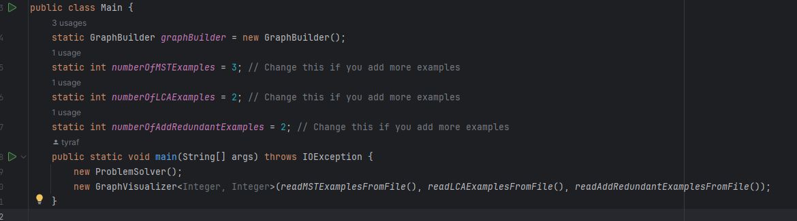

# Add example graphs

The example graphs are stored as text files in the [input/visualization](../input/visualization) folder.
There are two steps to this guide:

- [Step 1: Writing a graph file](#how-to-write-a-graph-file)
- [Step 2: Importing the file to the visualizer](#getting-main-to-look-for-you-file)

> ❗Please read the guide carefully before you start. If you do not follow these steps, the visualizer might not work as
> expected.

## How to write a graph file

### Naming convention

All files are named with the algorithm name followed by the next number in the numbering sequence for that algorithm.

* Minimum Spanning Tree ---> MST
* Least Common Ancestor ---> LCA
* Add Redundant ---> REP

Add the number after the algorithm name, and use the file extension `.txt`.

Example: `MST2.txt`, `REP1.txt` etc.

The files all have a descriptor, followed by all the edges that are to be included in the graph.

### Descriptor

For Minimum Spanning Tree examples, line 1 of the file must be the number of vertices and the number of edges the graph
contains.

For Least Common Ancestor and Add Redundant, line 1 of the file must be the number of vertices the graph contains.

### Edge list

Each following line in the file represents an edge from one vertex to another. Make sure to only put valid vertices (
within the range of the descriptor number of vertices), and make sure to only put one edge per line.

> ❗Please make sure that all examples added for Least Common Ancestor and Add Redundant are trees - that is, that the
> graph is connected and acyclic. All graphs are undirected in the visualizer.

Example: `0 1`, `12 14`, `3 11`.

Feel free to look at the examples that are already there for further guidance and inspiration.

> ❗ If you do not format the file correctly, the visualizer might not work as expected. Make sure to only include
> correctly formatted examples.

## Getting main to look for you file

When you have added a correctly formatted file to the [input/visualization](../input/visualization) folder, you must
update the number of examples in [main](../src/main/java/Main.java):

This way, the program will look for the correct number of examples when importing examples to the visualizer.

> ❗This requires you to name the file according to the naming convention described above. If you do not update the
> number of examples, your example graph will not show up in the visualizer.

---

Now you have created your very own examples for the visualizer!
Feel free to share these with your fellow students as you please, this is NOT consider as plagiarism 😊