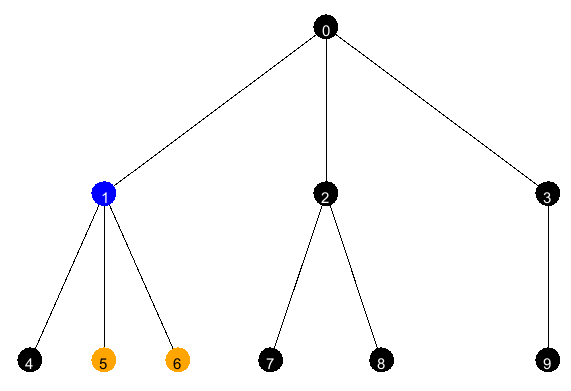

# Task 2
After the power grid has been built the power company has recieved a number of inquiries about power outages. Modern power grids often have an automatic alert system telling us where in the network the cause of the outage is located, but our power grid does not have such a system. Often times when a power outage occurs several houses loose power at the same time. A power outage can be seen as an edge of the network being removed. The nodes that are still part of the connected component with the power plant are recieving electricity, while all other nodes are not recieving electricity. To find the source of the outage as fast as possible we need to find the node of the network next to the cable which is most likely to have been the cause of the fault in the power grid, and start the error search from there. When two messages, from two seperate houses, about the outage has been recieved it is safe to assume that it comes from the same error in the network. Hence, the error must be in a cable that connected both these houses to the power plant.

Given two nodes ``u`` and ``v`` find a node to conduct the outage search from. The error must have occurred in a cable which connects both nodes to the same connected component as the power plant. This problem in the litterature is called *Lowest Common Ancestor* (LCA). The optimal datastructure for LCA (which you can find by googling) is not part of the INF102 curriculum. You are not required to implement the optimal algorithm, but rather you are to implement a simple algorithm. It is possible to find a solution which runs in *O(n)*. To get full points for the task your solution also has to be efficient.

**Implement ``IProblem::lca``.** By passing ``ProblemSolverLCATest`` you will get full points for functionality.

In the example below `u=5` and `v=6`. Their least common ancestor is `1`.

