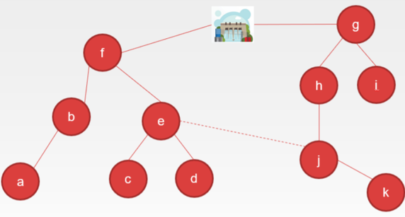

### Task 3
After many complaints the power company has realised that the cheapest solution is not always the best. In a new attempt to solve the problem they will be adding an extra cable (an extra edge) to the network (graph). The goal is to have an outage impact the least amount of houses. One faulty cable can cause a large number of houses to lose power. You are to find a pair of nodes which by adding a cable between them will minimize the number of houses affected if another cable fails.

In the example above if the edge between the **power plant** and node **f** fails then 6 nodes will lose access to electricity. If we add an edge between **e** and **j** this problem will be averted as all nodes will still be in the same connected component as the **power plant**. Then the largest power outage that can occur (removal of one edge) is 2 (the edge between **f** and **b** fails).

**Implement ``IProblem::addRedundant``.** By passing ``ProblemSolverREPTest`` you will get full points for functionality. To get full points for the task your solution also has to be efficient.
